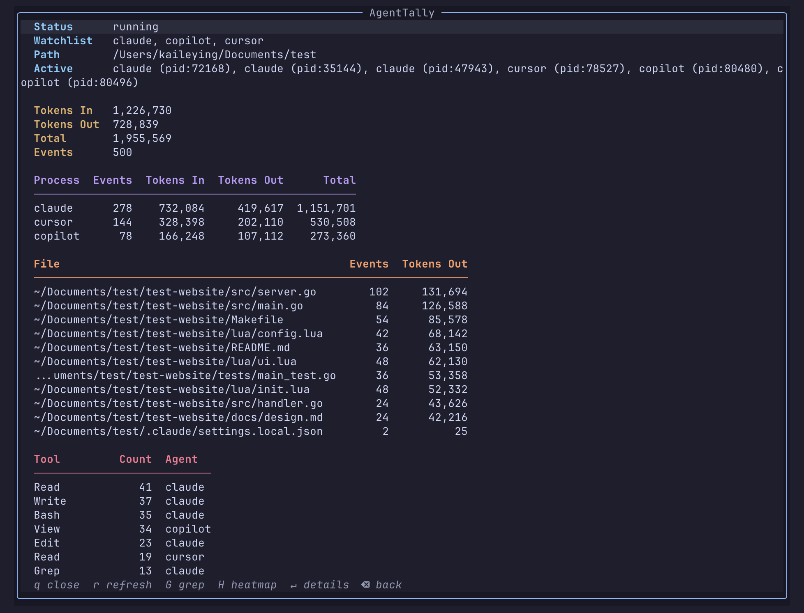
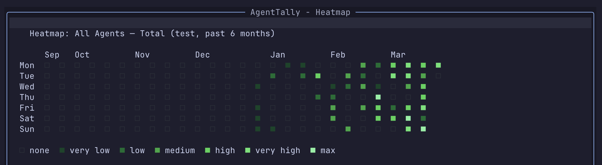
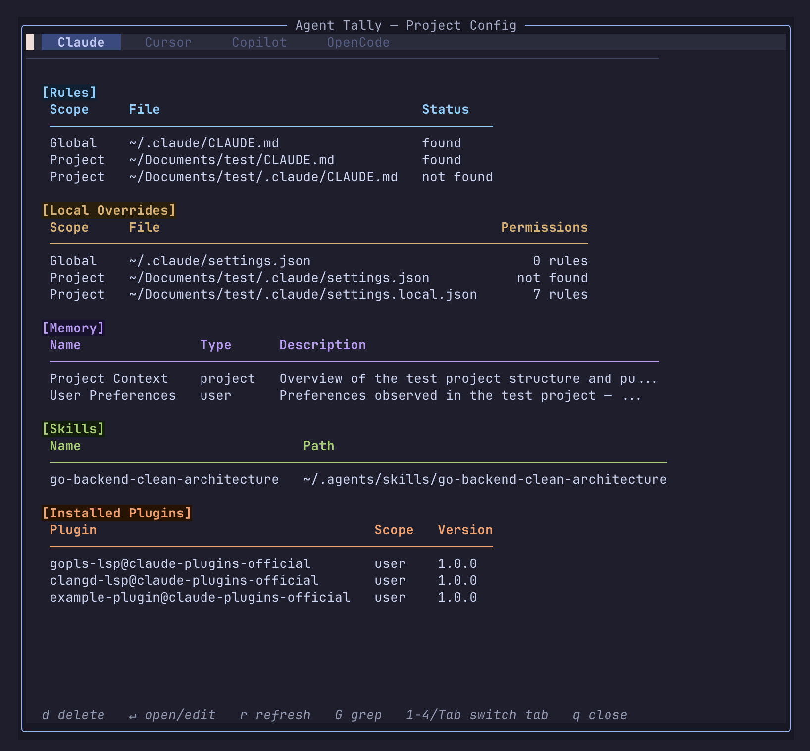

<div align="center">
    <h1>agent-tally.nvim</h1>
</div>


<p align="center">
    <a href="https://neovim.io/" target="_blank"></a>
    <a href="https://github.com/BinL233/agent-tally.nvim/actions/workflows/ci.yml" target="_blank"></a> 
    
    


</p>

A Neovim plugin and system-wide daemon that tracks AI token usage to your files and tool activity across your projects. It monitors file I/O and command execution from AI coding assistants like Claude Code, Cursor, Copilot, and OpenCode, giving you a clear picture of Tokens In / Token Out, and the specific tools used to get the job done.







## Requirements

- Neovim >= 0.10
- Go >= 1.21 

## Installation

### 1. Install the Neovim plugin

**lazy.nvim**

```lua
{
  "BinL233/agent-tally.nvim",
  config = function()
    require("agent-tally").setup({
      -- auto_start = true,  -- optionally start the daemon with Neovim
    })
  end,
}
```

**packer.nvim**

```lua
use {
  "BinL233/agent-tally.nvim",
  config = function()
    require("agent-tally").setup()
  end,
}
```

**vim-plug**

```vim
Plug 'BinL233/agent-tally.nvim'

" In your init.vim / init.lua:
lua require("agent-tally").setup()
```

### 2. Build the sidecar daemon

**Auto Way (Recommended)**:
```sh 
:AgentTallyBuild
```


**Manual Way**:
```sh
# Produces `sidecar/build/agent-tallyd`
cd ~/.local/share/nvim/lazy/agent-tally.nvim  # or wherever your plugin manager clones to
make build  # Go required

# Copies `agent-tallyd` to `~/.local/bin/`.
# Alternative root bin way: `sudo cp sidecar/build/agent-tallyd /usr/local/bin/`
sudo make install
```


## Compatible AI Agents

The following agents are monitored by default. Use `:AgentTallyWatchlist` to enable/disable individual tools.

| Agent | Process Name |
|-------|-------------|
| [Claude Code](https://claude.ai/code) | `claude` |
| [Cursor](https://cursor.sh) | `cursor` |
| [GitHub Copilot](https://github.com/features/copilot) | `copilot` |
| [OpenCode](https://opencode.ai) | `opencode` |

Any other CLI tool can be added via `:AgentTallyWatchlist`, just enter the process name as it appears in `ps`.

## How It Works

Agent Tally tracks token usage through two complementary methods:

### File I/O Monitoring

The daemon watches your project directories for file writes by AI tools. Each write produces an I/O event:
- **I/O In**: Estimated tokens the agent read from the existing file content
- **I/O Out**: Estimated tokens the agent generated and wrote to the file

> **Note**: I/O token counts are estimates based on file size changes (~4 bytes per token). They represent file-level activity only and do not include conversation context, system prompts, or extended thinking.

### Actual API Token Tracking

For Claude Code and Copilot, the daemon also parses the agent's local log files to capture real API-level token counts per request:
- **API In**: Exact input tokens consumed (includes prompt, cache creation, and cache read tokens)
- **API Out**: Exact output tokens generated (includes extended thinking tokens)

These actual counts are shown in a separate **API Tokens** table on the dashboard alongside the estimated I/O table, so you can compare file-level activity with true model usage.

### Current Watching Abilities
| Agent | I/O Tracking | API Tracking |
| ----- | ------------ | ------------ |
| Claude Code | ✓ | ✓ |
| Github Copilot | ✓ | ✓ |
| Cursor | ✓ | x |
| OpenCode | ✓ | x |

## Usage

### Commands

| Command                | Description                              |
|------------------------|------------------------------------------|
| `:AgentTally`          | Open the dashboard (auto-starts daemon)  |
| `:AgentTallyBuild`     | Automatically build daemon and setup     |
| `:AgentTallyStart`     | Start the sidecar daemon manually        |
| `:AgentTallyStop`      | Stop the sidecar daemon                  |
| `:AgentTallyStatus`    | Show daemon status and watchlist         |
| `:AgentTallyWatchlist` | Toggle which AI tools to monitor         |
| `:AgentTallyClean`     | Clean recorded events in the current directory | 
| `:AgentTallyCleanAll`     | Clean all recorded events |

### Running the daemon standalone

```sh
agent-tallyd                                    # watch cwd, default settings
agent-tallyd --watch ~/projects                 # watch a specific directory
agent-tallyd --watch ~/proj1,~/proj2            # watch multiple directories
agent-tallyd --depth 5                          # limit recursive depth
agent-tallyd --db ~/my-events.db                # custom database location
agent-tallyd --socket /tmp/my.sock              # custom socket path
```

### Dashboard keybindings

| Key         | Action                                          |
|-------------|-------------------------------------------------|
| `q` / `Esc` | Close dashboard                                 |
| `r`         | Refresh data                                    |
| `G`         | Grep / filter entries                           |
| `Enter`     | Drill into detail (event, file, or full table)  |
| `Backspace` | Go back to previous view                        |
| `Ctrl-j`    | Next entry                                      |
| `Ctrl-k`    | Previous entry                                  |
| `H`         | Generate heatmap (scope → agent → metric)       |

### Configuration

```lua
require("agent-tally").setup({
  -- Path to the agent-tallyd binary (default: "agent-tallyd")
  daemon_bin = "agent-tallyd",

  -- UNIX socket path, must match the daemon's --socket flag
  socket_path = (os.getenv("XDG_RUNTIME_DIR") or "/tmp") .. "/agent-tally.sock",

  -- PID file path used to prevent duplicate daemon instances
  pid_file = (os.getenv("XDG_RUNTIME_DIR") or "/tmp") .. "/agent-tally.pid",

  -- Auto-start the daemon when Neovim opens (default: false)
  auto_start = false,

  -- Status line format (%t = total tokens, %p = process name)
  statusline_format = " [AT: %t tokens]",

  -- Query limits 
  query = {
    events_limit = 500,  -- max events loaded into the dashboard per open
    skills_limit = 50,   -- max skill rows fetched for the By Skill section
  },

  -- UI options
  ui = {
    width = 0.8,        -- 80% of editor width
    height = 0.8,       -- 80% of editor height
    border = "rounded", -- border style
  },

  -- Dashboard keymaps
  keymaps = {
    close = { "q", "<Esc>" },
    drill_down = "<CR>",
    back = "<BS>",
    next_entry = "<C-j>",
    prev_entry = "<C-k>",
    grep = "G",
    refresh = "r",
    heatmap = "H",  -- generate heatmap (scope → agent → metric)
  },
})
```

## License
[MIT](LICENSE)
